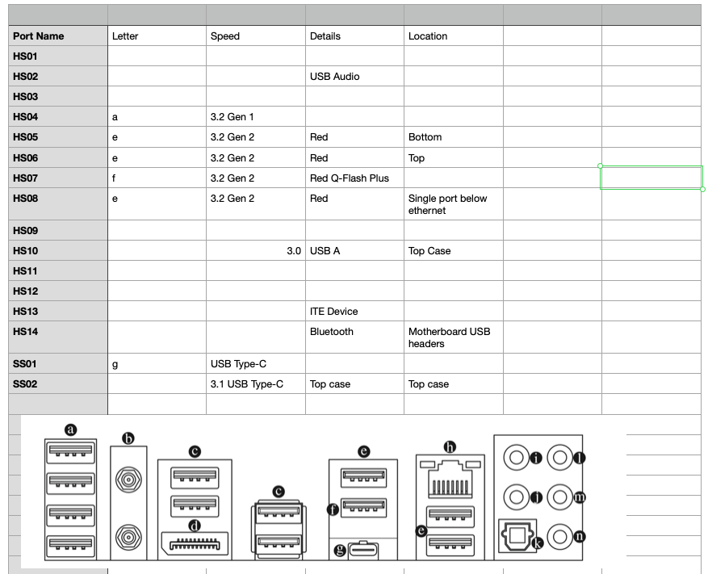
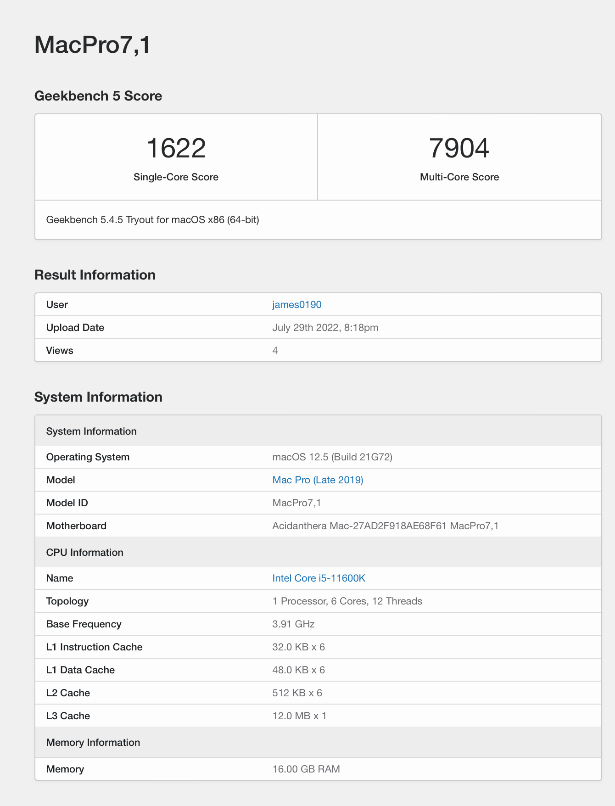

# Z590 Aorus Ultra + i5-11600K + AMD 6600 XT OpenCore

# Introduction

I was previously running a Z390i Aorus Pro WiFi with the i5-9600K which worked extremely well. I wanted to upgrade to a newer gen board and try to make use of my old Apple Thunderbolt display which works with the Alpine Ridge pcie card straight out of the box I was amazed to find! Other gen cards may need flashing.

I have now ditched the onboard Intel NIC and using my old BCM94360CS2 with a PCIE adapter which I will detail further down this guide.

# Summary of what works/doesn't work so far

:white_check_mark: WiFi

:white_check_mark: Bluetooth (Airpod's/Keyboard)

:white_check_mark: Audio (Although some more specific drivers are probably required)

:white_check_mark: 3.x USB's, USB C (Motherboard)

:white_check_mark: Handoff

:white_check_mark: Sleep/Wake

:white_check_mark: Displayport / HDMI

:white_check_mark: Ethernet (Needs additional config in the OS)

:white_check_mark: Airdrop, Unlock with Apple Watch

:x: Sidecar - I suspect something isn't configured quite right

:x: USB 2.0 ports - can't seem to figure out how to map them

:x: iGPU (Disabled in bios)

# Hardware

| Component     | Details                                                                             |
| ------------- | ----------------------------------------------------------------------------------- |
| CPU           | Intel&reg; i5-11600K (Rocket Lake)                                                  |
| Motherboard   | Gigabyte Z590 Aorus Ultra ATX for LGA 1200                                          |
| GFX           | AMD 6600 XT Sapphire Pulse                                                          |
| RAM           | Corsair CMK16GX4M2B3000C15 Vengeance LPX 16 GB (2 x 8 GB) DDR4 3000 MHz C15 XMP 2.0 |
| PSU           | Corsair RM650x 80 Plus Gold 650 W                                                   |
| Case          | Corsair 4000D Airflow Mid-Tower ATX                                                 |
| LAN           | i225-V (onboard Intel&reg; 2.5GbE LAN)                                              |
| WiFi & BT     | BCM94360CS2 & WiFi Bluetooth 4.0 PCIE Card adapter                                  |
| Audio         | Realtek® ALC4080 codec (No kext required)                                           |
| Storage       | Sabrent 512GB Rocket NVMe PCIe M.2 2280                                             |
| Thunderbolt   | Gigabyte Alpine Ridge 40gb/s Intel thunderbolt 3 add-in card                        |

# BIOS

Disable:

- Fast Boot
- Secure Boot
- VT-D
- iGPU

Enable:

- Above 4G decoding
- Hyper-Threading
- EHCI/XHCI Hand-off
- OS Type: Windows
- SATA Mode: AHCI
- VT-X

There were others mentioned in the <a href="https://github.com/dortania/OpenCore-Install-Guide/pull/343">Add Rocket Lake Support PR - OpenCore-Install-Guide</a> but I was unable to locate them in my BIOS settings. I will revisit when I have more time.

# Software Configuration

I'm using the latest version of opencore 0.8.2 and running Mac OS Monterey

## SSDT's

- <a href="https://github.com/dortania/Getting-Started-With-ACPI/blob/master/extra-files/compiled/SSDT-AWAC.aml" target="_blank">SSDT-AWAC.aml</a>

- <a href="https://github.com/dortania/Getting-Started-With-ACPI/blob/master/extra-files/compiled/SSDT-EC-USBX-DESKTOP.aml" target="_blank">SSDT-EC-USBX-DESKTOP.aml</a>

- <a href="https://github.com/dortania/Getting-Started-With-ACPI/blob/master/extra-files/compiled/SSDT-PLUG-DRTNIA.aml" target="_blank">SSDT-PLUG-DRTNIA.aml</a>

- <a href="https://github.com/dortania/Getting-Started-With-ACPI/blob/master/extra-files/compiled/SSDT-RHUB.aml" target="_blank">SSDT-RHUB.aml</a>

SSDT-SBUS-MCHC.aml (Needs compiling manually but I took it from <a href="https://github.com/nickw444/opencore-efi-z590">nickw444's Gigabyte Z590 Aorus Elite Monterey Hackintosh</a>. However do not use this EFI as it is not compatible with this hardware.

## Drivers
- HfsPlus.efi (Commit 16/01/2022)

- OpenRuntime.efi (0.8.2)

- OpenCanopy.efi

## Kexts
- <a href="https://github.com/OpenIntelWireless/itlwm/releases/tag/v2.1.0" target="_blank">Airportltlwm (v2.1.0_stable_Monterey)</a>

- <a href="https://github.com/acidanthera/BrcmPatchRAM" target="_blank">BlueToolFixup (2.6.3)</a>

- <a href="https://github.com/OpenIntelWireless/IntelBluetoothFirmware/releases/tag/v2.1.0" target="_blank">IntelBluetoothFirmware (v2.1.0)</a>

- <a href="https://github.com/OpenIntelWireless/IntelBluetoothFirmware/releases/tag/v2.1.0" target="_blank">IntelBluetoothInjector (v2.1.0) - DISABLED</a>

- <a href="https://github.com/acidanthera/Lilu/releases/tag/1.6.1" target="_blank">Lilu (v.1.6.1)</a>

- <a href="https://github.com/RehabMan/OS-X-USB-Inject-All" target="_blank">USBInjectAll (latest)</a>

- <a href="https://github.com/osy/USBWakeFixup" target="_blank">USBWakeFixup</a>

- <a href="https://github.com/acidanthera/VirtualSMC/releases/tag/1.3.0" target="_blank">VirtualSMC (v.1.3.0)</a>

- <a href="https://github.com/acidanthera/WhateverGreen/releases/tag/1.6.0" target="_blank">WhateverGreen (v.1.6.0)</a>

- USBMap (Needs building manually and bluetooth wont be enabled until this is mapped - see tools)

## Tools

- <a href="https://github.com/corpnewt/USBMap" target="_blank">USB Map Tool</a>

## Thunderbolt display & Alpine Ridge

To get the display working you simple plug in the alpine ridge card into a pcie slot and connect up to the thunderbolt header on the motherboard. Then use the loop back display cable between your GPU and the alpine ridge card. I then used an official Apple Thunderbolt 3 (USB-C) to Thunderbolt 2 Adapter to plug in the Thunderbolt 2 cable from the monitor. Worked instantly without any patches to the card.

## WiFi & Bluetooth

To get the BCM94360CS2 working I used an adapter from <a href="https://amzn.eu/d/1DfFikv">Amazon</a> which claimed to work natively without additional kexts. However it seemed I still needed to install the BCRM fixup, firmware and patch3 kexts. I already had the BCM card left over from a previous build but you can find them all over eBay.

## Ethernet

### config.plist
- I set my device property to PciRoot(0x0)/Pci(0x1C,0x1)/Pci(0x0,0x0) -> device-id: F2150000
- I left the Kernel patch in place for I225-V (disabled: false) as it doesn't apply to Monterey anyway
- I set my boot arg to e1000=0

### OS Configuration
- In the advanced settings of my ethernet I set the hardware tab to 1000baseT, "full-duplex, flow-control", Standard (1500)

## USB Mapping

What i've worked out so far..

## Benchmark's

## Sources

> :memo: **Note:** I realise this link may not work forever but at the moment its the only decent source.

- <a href="https://github.com/dortania/OpenCore-Install-Guide/pull/343">Add Rocket Lake Support PR - OpenCore-Install-Guide</a>

> :warning: **Warning** DISCLAIMER: This EFI does not work for my specific build!!! It crashes at the recovery Apple logo but can be used to borrow files from if necessary.

- <a href="https://github.com/nickw444/opencore-efi-z590">nickw444's Gigabyte Z590 Aorus Elite Monterey Hackintosh</a>

Special Thanks

- CorpNewt in the "Hackintosh & PC Tech" discord server for pointing me in the direction of the Z590 guide at gone 11PM!
